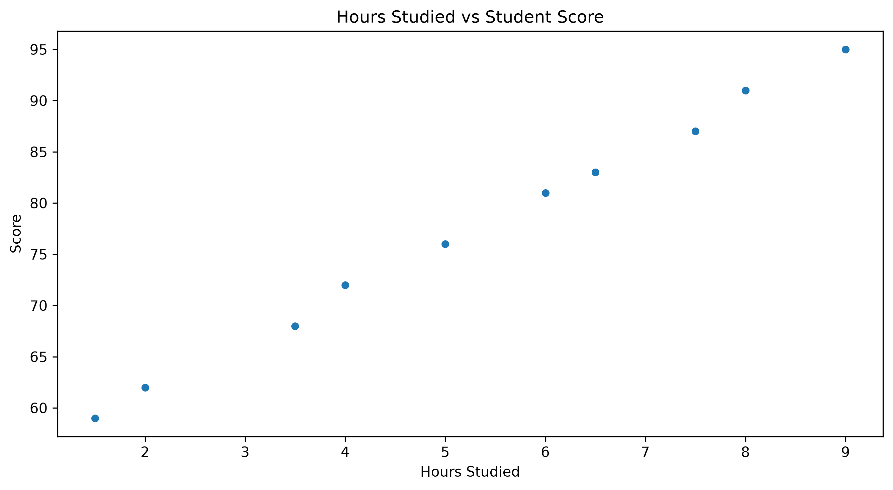
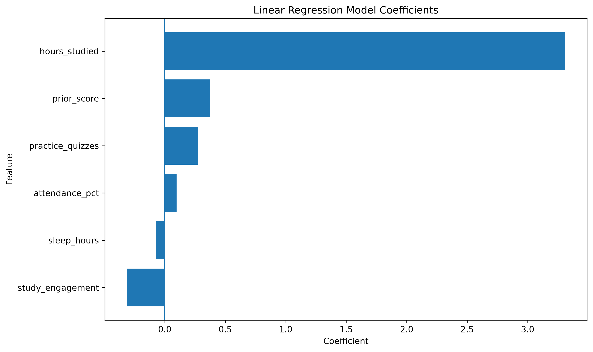
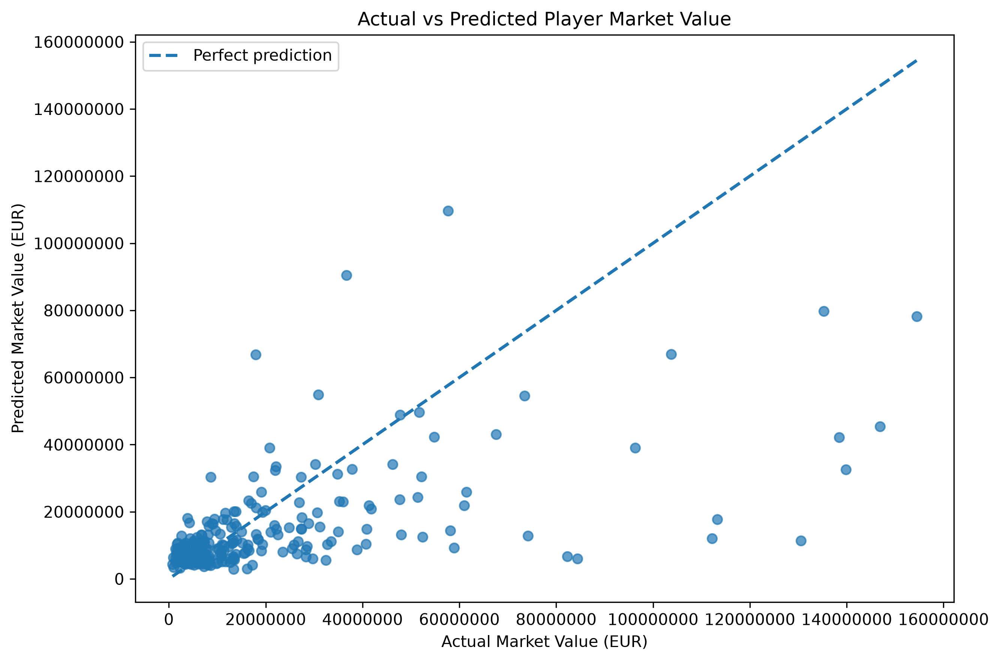

# ml-01-intro

[](https://denisecase.github.io/pro-analytics-02/workflow-b-apply-example-project/)
[](./pyproject.toml)
[](./LICENSE)

> Professional Python project: characterizing machine learning.

## Project Overview

This project focuses on identifying useful data problems and deciding when
machine learning may be appropriate.

The original course project introduces two broad problem types:

- **Supervised learning**: a target is selected for prediction.
- **Unsupervised learning**: no target is selected; the data is explored for
  patterns such as clusters.

A discrete target usually indicates a classification problem, while a
continuous numeric target usually indicates a regression problem. Some numeric
values, such as ratings from 1 to 3, may still be better treated as categories.

This repository preserves the original course example and adds:

- **Phase 4**: a small technical modification to the student-score regression
  example.
- **Phase 5**: a custom regression project that predicts football-player market
  value from World Cup performance data.

## Main Project Files

| Area | Purpose |
|---|---|
| `data/raw/` | Original datasets used for exploration |
| `data/processed/` | Prepared data with one record per player |
| `data/output/` | Saved model predictions |
| `docs/` | Project narrative and documentation |
| `docs/images/` | Charts used in the README and documentation |
| `notebooks/` | Interactive analysis notebooks |
| `src/mlstudio/` | Example and custom Python applications |
| `pyproject.toml` | Project dependencies, authorship, and URLs |
| `zensical.toml` | Documentation configuration |

## Example Notebook

The original notebook is preserved as provided:

- [ml_01_case.ipynb](notebooks/ml_01_case.ipynb)

The course guidance recommends keeping the example notebook unchanged and
copying it when creating a personalized version. See
[docs/your-files.md](docs/your-files.md) for details.

## Course Workflow

The project follows the
[pro-analytics-02 workflow guide](https://denisecase.github.io/pro-analytics-02/workflow-b-apply-example-project/):

1. **Phase 1 — Start & Run**
2. **Phase 2 — Change Authorship**
3. **Phase 3 — Read & Understand**
4. **Phase 4 — Modify**
5. **Phase 5 — Apply**

Completing Phases 1–4 is the main Module 1 goal. Phase 5 is optional in the
original Module 1 instructions, but it is completed in this repository.

## Quick Start

Clone and open the project:

```shell
git clone https://github.com/sabrouch36/ml-01-intro
cd ml-01-intro
code .
```

Create and synchronize the environment:

```shell
uv self update
uv python pin 3.14
uv lock --upgrade
uv sync --extra dev --extra docs --upgrade
```

Run the original example:

```shell
uv run python -m mlstudio.app_case
```

Run the quality checks:

```shell
uv run ruff format .
uv run ruff check . --fix
uv run python -m pyright
uv run python -m pytest
uv run python -m zensical build
```

---

# Phase 4: Technical Modification

## Custom Student-Score Regression

The custom implementation is located in:

- `src/mlstudio/app_sabri.py`

The custom dataset is located in:

- `data/raw/hours_scores_sabri.csv`

### Modification

A derived feature named `study_engagement` was added:

```python
study_engagement = hours_studied * attendance_pct / 100
```

The original model used five features. The modified model uses six:

- `hours_studied`
- `practice_quizzes`
- `attendance_pct`
- `sleep_hours`
- `prior_score`
- `study_engagement`

The derived feature is created for both the training data and each new
prediction case.

### Workflow

The modified application:

1. Loads the student dataset.
2. Inspects its shape, columns, and data types.
3. Checks missing values and duplicate rows.
4. Creates `study_engagement`.
5. Splits the data into training and testing sets.
6. Trains a `LinearRegression` model.
7. Evaluates the model with MAE and R-squared.
8. Predicts one new student score.
9. Creates and saves two visualizations.

### Results

| Metric | Result |
|---|---:|
| Dataset rows | 10 |
| Missing values | 0 |
| Duplicate rows | 0 |
| Mean Absolute Error | 0.48 |
| R-squared | 1.00 |
| Predicted score | 83.4 |

The prediction case used 6.5 study hours, 4 practice quizzes, 92% attendance,
7 hours of sleep, a prior score of 72, and a calculated
`study_engagement` value of 5.98.

`hours_studied` had the strongest positive coefficient. Because the dataset
contains only 10 records and several related features, the high R-squared value
may indicate overfitting and should be interpreted cautiously.

### Visualizations

#### Hours Studied vs Student Score



#### Linear Regression Model Coefficients



### Run Phase 4

```shell
uv run python -m mlstudio.app_sabri
```

Close the chart windows after reviewing them so the program can finish.

---

# Phase 5: Custom World Cup Player Value Project

## Project Question

> Can player characteristics and tournament-performance statistics be used to
> predict a football player's market value?

This is a supervised regression problem because `market_value_eur` is a known,
continuous numeric target.

## Dataset

The project uses a synthetic World Cup 2026 player-performance dataset.

The raw dataset contains:

- 54,600 match-level records
- 1,248 unique players
- 75 columns
- No duplicate player-match records
- No missing values in the selected modeling columns

Because the same player appears in multiple matches, the raw data is aggregated
into one record per player before model training. This prevents the same player
from appearing in both the training and testing sets.

## Phase 5 Files

| File | Purpose |
|---|---|
| `data/raw/world_cup_2026_players.csv` | Original match-level dataset |
| `data/processed/world_cup_players_model.csv` | Aggregated player-level dataset |
| `data/output/world_cup_player_value_predictions.csv` | Test predictions and errors |
| `src/mlstudio/prepare_world_cup_data.py` | Data aggregation and preparation |
| `src/mlstudio/app_world_cup.py` | Regression pipeline and evaluation |
| `docs/images/world_cup_actual_vs_predicted.png` | Final model visualization |

## Data Preparation

The preparation module groups records by `player_id` and creates one player-level
record using totals or averages for:

- Minutes played
- Goals
- Assists
- Shots on target
- Expected goals
- Expected assists
- Pass accuracy
- Defensive actions
- Distance covered
- Top speed
- Stamina score
- Player rating

The resulting processed dataset contains 1,248 players and 21 columns.

Run the preparation step:

```shell
uv run python -m mlstudio.prepare_world_cup_data
```

## Modeling Approach

The model uses a scikit-learn pipeline with:

- `train_test_split`
- `StandardScaler`
- `OneHotEncoder`
- `ColumnTransformer`
- `LinearRegression`
- `TransformedTargetRegressor`

The target is transformed with `log1p` because player market values are highly
skewed. Numeric and categorical features are processed separately, and
performance statistics are normalized per 90 minutes.

## Model Results

The data was split into 998 training players and 250 testing players.

| Metric | Result |
|---|---:|
| Baseline median prediction | €10,194,198 |
| Baseline Mean Absolute Error | €15,243,531 |
| Model Mean Absolute Error | €11,985,172 |
| Root Mean Squared Error | €22,912,425 |
| R-squared | 0.300 |
| MAE improvement over baseline | 21.38% |

The model reduced Mean Absolute Error by 21.38% compared with the baseline. An
R-squared value of 0.300 means the selected features explain approximately 30%
of the variation in market value.

## Actual vs Predicted Market Values



The dashed diagonal line represents perfect predictions. The model performs
more consistently for low- and moderate-value players and often underestimates
players with extremely high market values.

## Run Phase 5

Prepare the dataset:

```shell
uv run python -m mlstudio.prepare_world_cup_data
```

Train and evaluate the model:

```shell
uv run python -m mlstudio.app_world_cup
```

Predictions are saved to:

```text
data/output/world_cup_player_value_predictions.csv
```

## Phase 5 Conclusion

This custom project demonstrates how to:

- Apply supervised regression to a new domain
- Prepare and aggregate a large dataset
- Prevent player-level data leakage
- Engineer per-90-minute features
- Process numeric and categorical variables
- Compare a trained model with a baseline
- Save predictions and create a final visualization

The model outperformed the baseline, but player market value also depends on
factors not included in the dataset, such as club reputation, contract details,
transfer demand, injuries, and future potential.

---

## Original Course Guidance

<details>
<summary><strong>Show the preserved instructor guidance, notes, troubleshooting, and example output</strong></summary>

### Challenges

Challenges are expected. Instructions may not always match every operating
system. When issues occur, share screenshots, error messages, and details about
what you tried. Working through problems is part of implementing professional
projects.

### Success

After completing Phase 1, the repository should contain the executed and
committed example notebook. Running the example module should print:

```shell
========================
Executed successfully!
========================
```

A `project.log` file will appear in the project root.

### Complete Command Reference

Install and configure project tools:

```shell
uv self update
uv python pin 3.14
uv lock --upgrade
uv sync --extra dev --extra docs --upgrade

uvx pre-commit install
uvx pre-commit autoupdate
```

Stage files and run pre-commit checks:

```shell
git add -A
uvx pre-commit run --all-files
uvx pre-commit run --all-files
```

Run the original example and project checks:

```shell
uv run python -m mlstudio.app_case
uv run ruff format .
uv run ruff check . --fix
uv run python -m pyright
uv run python -m pytest
uv run python -m zensical build
```

Save progress:

```shell
git add -A
git commit -m "update"
git push -u origin main
```

### Notes

- Use the **UP ARROW** and **DOWN ARROW** to revisit terminal commands.
- Use `CTRL+f` to find or replace text in a file.
- The provided tests are examples and do not need to be modified.
- Many project files are silent helpers.
- Complete understanding is not expected immediately; it develops with use.

### Troubleshooting Python Interactive Mode

If the terminal displays `>>>` or `...`, Python interactive mode was started
accidentally. Press `Ctrl+C`, or on Windows press `Ctrl+Z` and then `Enter`.

### Original Example Output

```shell
| INFO | ML | Summarize workflow........
| INFO | ML | ========================
| INFO | ML | SUMMARY
| INFO | ML | ========================
| INFO | ML | Dataset: hours_scores_case
| INFO | ML | Original rows: 10
| INFO | ML | Clean rows: 10
| INFO | ML | Features: ['hours_studied', 'practice_quizzes', 'attendance_pct', 'sleep_hours', 'prior_score']
| INFO | ML | Target: score
| INFO | ML | ----- in a script, call plt.show() once at the end to display all charts -----
| INFO | ML | ----- in a script, CLOSE the chart windows with the close button to CONTINUE -----
| INFO | ML | Workflow complete
| INFO | ML | IMPORTANT: This script creates chart windows.
| INFO | ML | Close chart windows and terminate this process with CTRL+c as needed.
| INFO | ML | ========================
| INFO | ML | Executed successfully!
| INFO | ML | ========================
```

### Findings and Visuals Guidance

The original instructions recommend adding screenshots and discussing the
results. A Markdown image uses an exclamation mark, a useful caption in square
brackets, and a relative image path in parentheses.

Custom figures and narrative should reflect the student's own work. The
`README.md` should include commands, process, and visuals, while
`docs/index.md` should contain the longer project narrative. Unnecessary
instructional comments should be removed from custom source files.

</details>

## Project Documentation

Additional project instructions, terms, and notes:

- [Documentation Home](docs/index.md)
- [Your Files](docs/your-files.md)
- [Project Instructions](docs/project-instructions.md)
- [Glossary](docs/glossary.md)
- [API](docs/api.md)

## Citation

- [CITATION.cff](./CITATION.cff)

## License

- [MIT License](./LICENSE)
